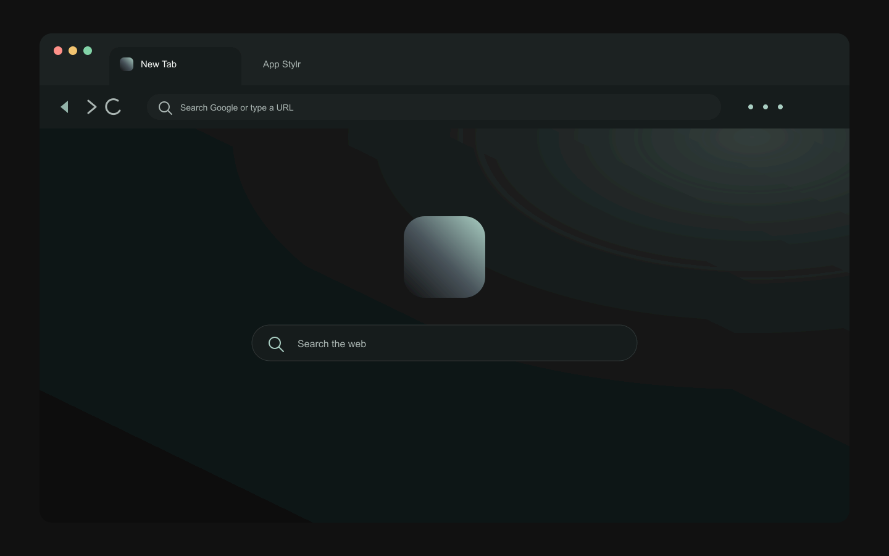

# App Stylr Dark Chrome theme

App Stylr Dark applies the canonical App Stylr palette to Chrome's browser frame, tabs, toolbar, omnibox, and new-tab page. It is a Manifest V3 theme with no permissions, scripts, or HTML.



The image above is a generated mockup of the intended appearance, not a screenshot of an installed Chrome window.

## Palette mapping

| Chrome surface | App Stylr source | Value |
| --- | --- | --- |
| Browser frame and vertical sidebar | Dark Surface raised | `#1D2222` |
| Active tab and toolbar | Dark Surface | `#171B1B` |
| Inactive window | Dark Sidebar | `#111515` |
| Omnibox | Dark Surface raised | `#1D2222` |
| Primary text | Dark Text | `#F3F7F5` |
| Secondary and inactive text | Dark Text muted | `#A9B5B2` |
| Toolbar buttons and links | Dark Accent | `#A9CEC2` |
| New-tab canvas | Dark Canvas | `#0D1010` |
| Incognito frame | Dark Selected | `#263D39` |

## Build it

From the repository root, run:

```sh
npm run chrome-theme
```

From an installed package, write a copy to a project-owned directory:

```sh
npx app-stylr-chrome-theme --output vendor/app-stylr-theme
```

This regenerates [`chrome-theme/manifest.json`](../chrome-theme/manifest.json), the icons, the new-tab background, and the preview from [`tokens/app-stylr.json`](../tokens/app-stylr.json). Do not edit generated theme files directly.

## Install it locally

1. Enter `chrome://extensions` in Chrome's address bar. Chrome internal pages cannot be opened from a normal web link.
2. Enable **Developer mode**.
3. Select **Load unpacked**.
4. Select the [`chrome-theme/`](../chrome-theme/) directory.

The theme applies immediately. Chrome treats a theme as a special kind of extension, but this one requests no permissions and contains no executable code.

## Remove it

Open Chrome **Settings**, choose **Appearance**, then select **Reset to default** beside the theme setting.

## Technical references

- [Chrome theme documentation](https://developer.chrome.com/docs/extensions/develop/ui/themes)
- [Chrome's Load unpacked instructions](https://developer.chrome.com/docs/extensions/get-started/tutorial/hello-world)
- [Google's theme removal instructions](https://support.google.com/chromebook/answer/148695)
